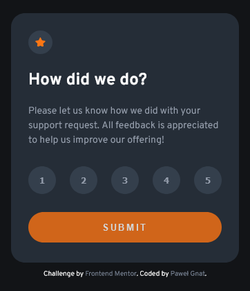

# Frontend Mentor - Interactive rating component solution

This is a solution to the [Interactive rating component challenge on Frontend Mentor](https://www.frontendmentor.io/challenges/interactive-rating-component-koxpeBUmI). Frontend Mentor challenges help you improve your coding skills by building realistic projects.

## Table of contents

- [Overview](#overview)
  - [Screenshot](#screenshot)
  - [Links](#links)
- [My process](#my-process)
  - [Built with](#built-with)
  - [What I learned](#what-i-learned)
- [Author](#author)

## Overview

### Screenshot

### Links

- Live Site URL: [Interactive Rating Component](https://pawel-gnat.github.io/Frontend-Mentor-Interactive-Rating-Component/)

## My process

Below is my thinking process of Java Script code:

1. Created consts
2. Created a loop function that go through all the buttons
3. Listening for an event click on each button and get the clicked number value
4. Loop through the buttons to check for a selected class (and remove if such)
5. Add selected class to highlight my final rate
6. Listen for an event click to go forward next card and display my selected rating.

### Built with

- Semantic HTML5 markup
- CSS custom properties
- Flexbox
- Mobile-first workflow
- JavaScript

### What I learned

I did this challenge in 5,5 hours. JavaScript took me 3 hours of coding. I had no problems with selecting card views, but I found too hard to toggle button values and add them to span in a loop. I needed to check a result from other devs. I have read from Slack that I should have used radio inputs for a accessibility but I also found it too hard to style it properly with a numbers inside inputs, so I left it with buttons. As you can see, my result text (span) isn't centered inside his background color. I don't know how to correct it.

I used BEM methodoloy and SCSS.

## Author

- Frontend Mentor - [@Pawel-Gnat](https://www.frontendmentor.io/profile/Pawel-Gnat)
